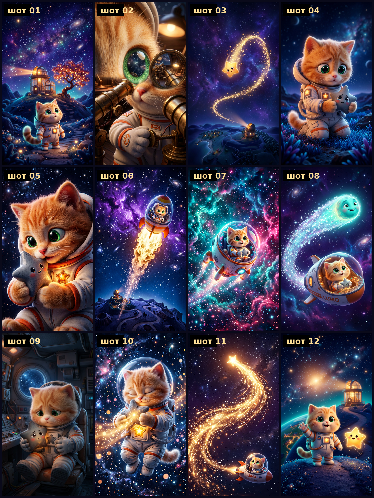

# «ЛУМ И ЗВЁЗДОЧКА» — мультфильм 60 секунд

Космический котёнок-хранитель звёзд Лум находит упавшую погасшую звёздочку и возвращает её на небо.
Стиль — 3D-анимация уровня Pixar, формат 9:16 (1080×1920), закадровый голос + музыка.

**Готовый файл:** [`out/lum_i_zvezdochka_60s.mp4`](out/lum_i_zvezdochka_60s.mp4) — 60.1 с, 30 к/с, H.264 + AAC.



---

## Что в папке

| Файл / папка | Что это |
|---|---|
| `РАСКАДРОВКА.md` | сценарий, 12 шотов по 5 с, план звука, промпты для Wan2.1 |
| `ПЕРСОНАЖИ.md` | character bible: Лум, Искорка, Комета, локации, палитра |
| `РАСКАДРОВКА-лист.png` | монтажный лист из 12 ключевых кадров |
| `frames/shot01..12.png` | ключевые кадры, 9:16 (генерировались как «film still») |
| `audio/line01..12.mp3` | закадровый голос по репликам (voice-00) |
| `audio/music.wav` | музыкальная дорожка 60 с (процедурный синтез, `build/make_music.py`) |
| `audio/mix.wav` | голос + музыка с дакингом (собирается пайплайном) |
| `build/pipeline.py` | весь монтаж: движение камеры, склейка, титры, звук, финальный мукс |
| `build/make_music.py` | синтезатор музыки (пэд, бас, колокольчики, шумы, реверб) |
| `build/subs.ass` | титры и субтитры (libass), генерируются пайплайном |
| `build/voice_plan.json` | фактические таймкоды реплик после подгонки темпа |
| `out/` | готовый мультфильм |

---

## Как собрано

1. **12 ключевых кадров** сгенерированы как статичные кадры фильма (9:16, стиль 3D Pixar).
   Ограничение этой песочницы: GPU нет, поэтому Wan2.1 локально не запускается —
   вместо настоящей анимации персонажа применён кино-приём «оживления» статики.
2. Каждый кадр анимируется фильтром `zoompan` (наезд / отъезд / проезд + микро-дрейф) →
   12 шотов по 5.47 с, апскейл до 1080×1920.
3. Шоты склеиваются `xfade` (наплывы; в кризисе — `fadeblack`, на вспышке — `fadewhite`) → 60.1 с.
4. Голос: подгонка темпа (до 1.28×) + расстановка по слотам шотов; музыка: 4 аккорда по кругу
   (Am–F–C–G → тёплый C-мажор в финале), дакинг музыки под речью −45 %.
5. Титры/субтитры рендерит libass (фильтр `ass`), `drawtext` в этой сборке ffmpeg отсутствует.
6. Финальный проход: `loudnorm=I=-16:TP=-1.5`, AAC 192 kbps / 48 кГц.

### Пересобрать (одна команда)

```bash
cd projects/space-cat
python3 build/make_music.py                      # музыка (~3 с)
python3 build/pipeline.py                        # весь монтаж (~10 мин на 2 CPU)
```

Полезные ключи: `--max-shots 10 --lines 10` (короткая версия), `--force-shots`, `--force-visual`,
`--no-title`, `--out путь.mp4`.

---

## Тайминги финального рендера

| # | Реплика | Таймкод | Темп |
|---|---|---|---|
| 1 | Высоко в звёздном небе жил котёнок Лум… | 0.35–5.28 | 1.28× |
| 2 | Каждую ночь он зажигал огоньки… | 5.43–9.95 | 1.21× |
| 3 | Но однажды маленькая звезда вздрогнула… | 10.28–14.80 | 1.13× |
| 4 | Лум нашёл её в траве… | 15.25–19.77 | 1.02× |
| 5 | «Не бойся, — прошептал он…» | 20.22–23.75 | 1.00× |
| 6 | Он взял свою ракету… | 25.18–29.70 | 1.05× |
| 7 | Мимо пронеслась комета… | 30.15–34.07 | 1.00× |
| 8 | Дорога была длинной… | 35.12–38.98 | 1.00× |
| 9 | Путь был долгим, и звёздочка почти погасла… | 40.08–44.26 | 1.00× |
| 10 | Тогда Лум обнял её и отдал своё тепло. | 45.05–48.82 | 1.00× |
| 11 | И звезда вспыхнула — ярко, как тысяча маяков! | 50.22–54.23 | только субтитр |
| 12 | С тех пор он знал: даже самый маленький свет… | 55.18–59.20 | только субтитр |

Реплики 11 и 12 пока идут **без озвучки** (упёрлись в лимит синтеза речи на ход) — субтитрами.
Как только озвучка добавлена, пайплайн сам подхватит `audio/line11.mp3`, `line12.mp3`
и пересоберёт звук заново (тяжёлая склейка берётся из кэша `/tmp/wan-cartoon/visual.mp4`).

---

## Что дальше (настоящая анимация на GPU)

Кадры из `frames/` — готовые первые кадры для image-to-video. Промпты на каждый шот — в
`РАСКАДРОВКА.md`, раздел 6. Кратко:

```bash
python generate.py --task i2v-14B --size 720*1280 --ckpt_dir ./Wan2.1-I2V-14B-720P \
  --image projects/space-cat/frames/shot01.png --frame_num 81
```

Для «оживления» реплик под готовую озвучку — `--task s2v-14B` (speech-to-video) с дорожками
из `audio/line*.mp3`. Затем собранные шоты можно снова склеить этим же пайплайном
(`--max-shots N`, если подменить файлы в `build/shots/`).
